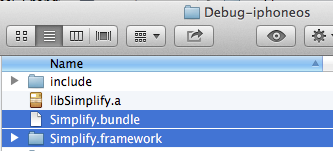
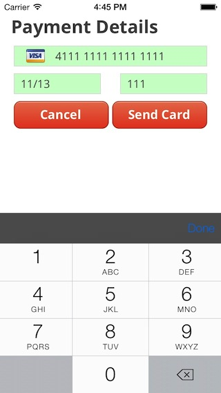
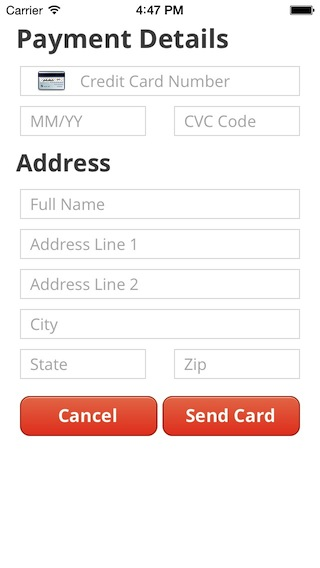

Simplify iOS SDK
==============

An iOS SDK that provides a ViewController for accessing the MasterCard Simplify Service.  Download the framework [here](http://www.asynchrony.com/wp-content/themes/asynchrony3/simplify-iossdk.zip).

Project Organization
--------------------

* ```Simplify``` - iOS Library Project containing SDK code
* ```SimplifyExample``` - an iOS Application utilizing the SDK
* ```SimplifyTests``` - unit tests for the library

## Building the Framework

In order to build the Documentation, simply fun the SimplifyFramework Scheme from XCode. This will build a universal framework and bundle for use in your project.


Once the script is done, a Finder window will open granting access to the built products.



## Building the Documentation

In order to build the Documentation for the public API, simply run the Documentation Scheme from XCode. This will automatically install the docset, so that XCode can utilize it.


## Installation

To install the API in your app, copy the `Simplify.framework` and `Simplify.bundle` to your project.
Add both to your app target.


## Using the API

Use the `SIMCreditCardEntryViewController` in your application, and accept delegate callbacks from it
to obtain a `SIMCreditCardToken`.  This token must be used in conjunction with one of the hosted
solutions documented on the [Simplify website](https://www.simplify.com/commerce/docs) to create
and process a transaction.

For example, in ruby, this token might be used server-side in the following manner:

```ruby

require 'simplify'
Simplify::public_key = "YOUR_PUBLIC_API_KEY"
Simplify::private_key = "YOUR_PRIVATE_API_KEY"
payment = Simplify::Payment.create({
    "token" => "<TOKEN ACQUIRED BY SIMPLIFY IOS SDK>",
    "amount" => 1000,
    "currency"  => "USD",
    "description" => "Description"
})
if payment['paymentStatus'] == 'APPROVED'
    puts "Payment approved"
end

```

### SIMCreditCardEntryViewController
The `SIMCreditCardEntryViewController` can be used for entering credit card and user mailing address 
details for a transaction.  Whether or not to include a mailing address form is controlled by the 
view controller's initializer `showAddressView` parameter.  See below example screenshots of the 
card entry interface with and without a mailing address form.  As a convenience, the view controller 
performs some (but not necessarily a full-proof) validation of the items entered.





### SIMCreditCardToken
The `SIMCreditCardToken` is issued to the user by `SIMCreditCardEntryViewController` to the assigned
`SIMCreditCardEntryViewControllerDelegate` via `receivedCreditCardToken:error` when credit card information 
has been successfully processed and a token is generated, otherwise an `NSError` is returned.  When a 
user cancels entry, the delegate's `tokenGenerationCancelled` is invoked.

To access the actual token value, for use in the server side API, refer to the `token` member of the
returned `SIMCreditCardToken` object.

